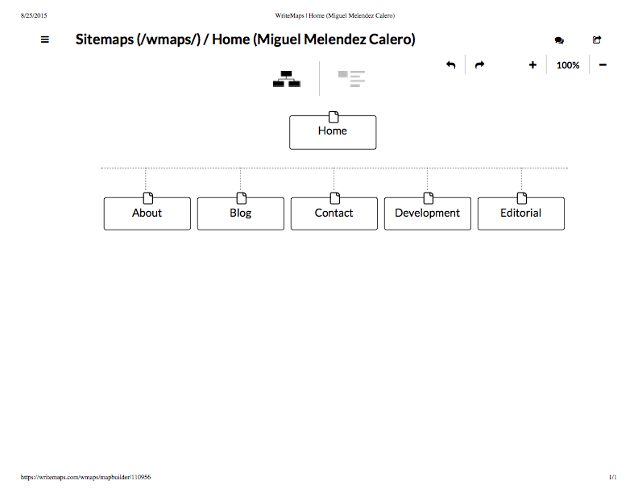

**What are the 6 Phases of Web Design?**
*Information Gathering
Planning
Design
Development
Testing and Delivery
Maintenance*

**What is your site's primary goal or purpose? What kind of content will your site feature?**
*This will serve as my professional website, a space to display my background/story, blog, projects, employment information, contact information.*

**What is your target audience's interests and how do you see your site addressing them?**
*My target audience would be any interested in software development and design.*

**What is the primary "action" the user should take when coming to your site? Do you want them to search for information, contact you, or see your portfolio? It's ok to have several actions at once, or different actions for different kinds of visitors.**
*I think the main function would be to read about me, browse some of my works/display my skillset, provide contact information, provide resume for employers.

**What are the main things someone should know about design and user experience?**
*Design is not "One Size Fits All."
User experience isn't the same thing as usability.
User expereince design can not be quanatatively measured.*

**What is user experience design and why is it valuable?**
*User experience design is all about how someone feels when interfacing with a system. This is usually in reference to some sort of human-computer interaction. User Expereince Design is important because it can help you determine the best ways to approach accessability, usability, and navigation.*

**Which parts of the challenge did you find tedious?**
*I didn't find any part of this assignment to be tedious. Every chance at navigating the command line, git, is welcome. Additionally, I learned a bit about markdown in this assigment.*
