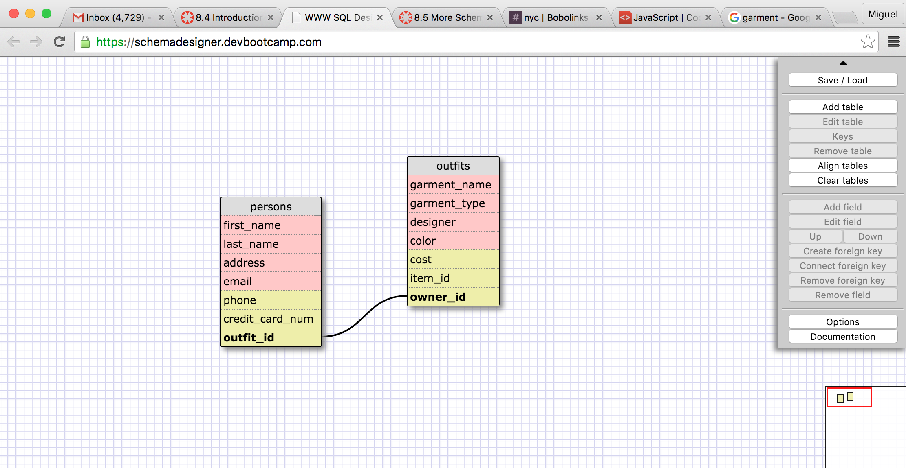

1) SELECT * FROM states;
2) SELECT * FROM regions;
3) SELECT state_name, population FROM states;
4) SELECT state_name, population FROM states ORDER BY population DESC;
5) SELECT state_name FROM states WHERE region_id='7'; 
6) SELECT state_name, population_density FROM states WHERE population_density > '50' ORDER BY population_density;
7) SELECT state_name FROM states WHERE population BETWEEN '1000000' AND '1500000';
8) SELECT state_name, region_id FROM states ORDER BY region_id;
9) SELECT region_name FROM regions WHERE region_name LIKE '%Central%';
10) SELECT regions.region_name, states.state_name FROM regions INNER JOIN states ON states.region_id=regions.id ORDER BY region_id;

**Reflection:**

**What are databases for?**
*Databases are used to hold large sets of data in such a form that it is easy to extract parts of the data for analysis. Using a Database Management System(DBMS) it is easy to set up and acceess data in order to iterate through for large scale processing.*

**What is a one-to-many relationship?**

*A one to many relationship is when one set of data can be said to belong to another, while the second has that same relationship with multiple entities.*

**What is a primary key? What is a foreign key? How can you determine which is which?**

* A primary key is the best way to differentiate between the different instances of the dataset, while foreign keys are keys in another table that refer to a particular instance.*

**How can you select information out of a SQL database? What are some general guidelines for that?**

*SELECT (column name) FROM (table) / SELECT FROM WHERE, SELECT FROM ORDER BY, SELECT FROM JOIN IN commands. *